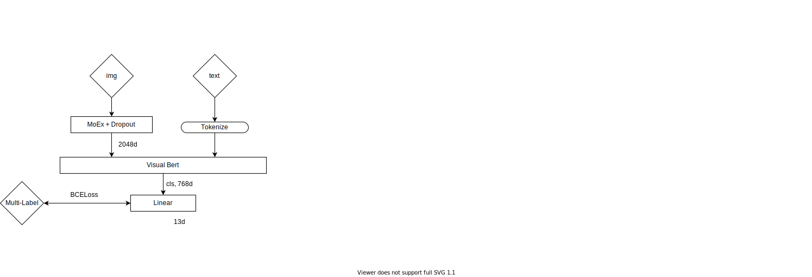

# 代码说明

赛题：[电商关键属性的图文匹配](https://www.heywhale.com/home/competition/620b34c41f3cf500170bd6ca)

初赛、复赛 B 榜都是第10，分数分别是0.94810257、0.9493570381231672。
这个仓库只有复赛的代码，初赛的代码差不多，但比较混乱，暂时没有整理。

## 环境配置

主要的依赖项:

python=3.8.8

pytorch=1.11.0=py3.8_cuda10.2_cudnn7.6.5_0

transformers=4.15.0=pypi_0

python-lmdb=1.2.1=py38h2531618_1

[Torchfast](https://github.com/Legend94rz/fasttorch)

jieba=0.42.1

[trexpark](https://github.com/youzanai/trexpark)

其中，trexpark是有赞开源的一些预训练模型及代码，似乎不能通过 pip 安装，线上作为数据源挂载。

## 文件路径
```{bash}
{root}
├---input/
|    ├--data/
|    |  ├--train_coarse.txt
|    |  ├--train_fine.txt
|    |  └--[test.txt]
|    └--trexpark/               # trex repo
|       ├--src/
|       ├--images/
|       └--[etc.]
└---project/
    ├--code/                    # this repo
    |   ├--multilabel/          # 模型一
    |   |  ├--train.py
    |   |  └--infer.py          # 推理脚本。输出概率。
    |   ├--pairwise/            # 模型二
    |   |  ├--train.py
    |   |  └--infer.py
    |   ├--prj_config.py        # 一些路径配置文件
    |   ├--defs.py              # 模型及所有在线增广
    |   ├--tools.py
    |   ├--preprocessing.py     # 预处理脚本
    |   └--postprocessing.py    # 集成各模型输出，并生成最终提交文件
    └--best_model/         
```
## 数据
未使用其他公开数据集。

## 预训练模型
使用了有赞的两个已公开的预训练模型权重：
`youzanai/bert-product-title-chinese`和`youzanai/clip-product-title-chinese`。因为线上没有联网，需要做成数据集挂载，离线验证时需要手动执行一次，下载 hugging-face 文件至本地缓存目录，默认路径是`${home}/.cache/huggingface`。

所有预训练模型及下载方式：
```{python}
clip.ClipChineseModel.from_pretrained('youzanai/clip-product-title-chinese') # clip使用方式见 trex 项目
AutoModel.from_pretrained("youzanai/bert-product-title-chinese")
AutoConfig.from_pretrained("uclanlp/visualbert-vqa-coco-pre")
AutoTokenizer.from_pretrained("youzanai/bert-product-title-chinese")
AutoModel.from_pretrained("bert-base-chinese")
```


## 算法
### 整体思路介绍
最终提交的结果是使用2种模型 —— pairwise-swa 和 visualbert —— 的融合结果：
前者5折bagging后与visualbert的输出取平均值，再用0.5作为分类阈值。
下面分别介绍这两种模型。

### 模型一：二分类（pairwise-swa）

模型伪代码:

`Transformer(cat([img_encode(img), text_encode(text)], dim=1)) -> 0/1`

用5折预先处理好的数据，分别增广，各训练一个模型，训练时结合SWA(Stochastic Weight Average)。在推理时取5折swa权重的输出的平均值(bagging)。

#### 网络结构


#### 损失函数
二分类损失：`nn.BCEWithLogitsLoss`

#### 数据扩增
对于关键属性，用图文匹配的数据做正负样本。
如`{'img_name': 'img1', 'title': "xxx", 'key_attr': {'领型': '高领', '图文': 1}}`
会针对【领型】做一个正样本，以及其他N个取值做N个负样本。

对于标题，分别进行正增广和负增广，其中:

* 正增广
  * 删除标题中出现的所有关键属性，或只保留一个
  * 不增广

* 负增广
  * 修改：最多把一个属性改成不匹配
  * 替换成其他标题，然后删除所有与该标题不匹配的属性。
  * coarse中的图文不匹配数据。

这里负样本数量最多生成 *标题中的属性个数* 个。

离线增广后，标题与关键属性的数据合并，一起训练。

### 模型二：visual bert multilabel
用`uclanlp/visualbert-vqa-coco-pre`初始化一个VisualBert，然后用`youzanai/bert-product-title-chinese`替换权重。
图片特征先经过[MoEx](https://openaccess.thecvf.com/content/CVPR2021/papers/Li_On_Feature_Normalization_and_Data_Augmentation_CVPR_2021_paper.pdf)、Dropout，然后与文本一起输入到VisualBert中，取`<cls>`的输出，计算multilabel loss（12个属性+1个图文，共13个标记）。

这个模型用的全量fine数据，增广后直接训练，结合swa，得到一个权重文件。推理时就用这一个权重文件的输出。
训练参数可以用划分好的验证集，适当调参数。

#### 网络结构


#### 损失函数
`nn.BCEWithLogitsLoss` （权重0.7）
加一个正则化项：
属性输出的概率最小值(带mask) 与 图文输出计算KL散度。因为如果图文匹配了，说明属性输出应该较大。（权重0.3）

#### 数据扩增
训练集在线增广，方式如下：

```{python}
# 按照概率列表，互斥地选择一个变换  
mutex_transform([  
    # 1. 序列变换  
    sequential_transform([  
        # 替换一个标题  
        random_replace(candidate_attr, candidate_title),  
        # 随机删除一个属性  
        random_delete(0.3),  
        # 随机替换一个属性  
        random_modify(0.3, prop)  
    ], [0.5, 0.4, 0.5]),  

    # 2. 互斥变换  
    mutex_transform([  
        delete_words(), # 分词后随机选择至少一个短语，删除。相应修改 match 的字段。  
        replace_hidden(),  # 随机换类型、颜色中的至少一个，没有这些则保持原输入。  
        sequential_transform([  
            delete_words(), # 分词后随机选择至少一个短语，删除。相应修改 match 的字段。  
            replace_hidden(),  # 随机换类型、颜色中的至少一个，没有这些则保持原输入。  
        ], [1., 1.])  
    ], [0.33, 0.33, 0.34]),  

    # 3. 不作变换  
    lambda x: x    
], [0.5, 0.45, 0.05])
```

### 模型集成
visualbert 与 pairwise的5折bagging，两者取平均值后，用作为分类阈值。

## 训练流程
预处理
```
python preprocessing.py
```

模型一训练
```
python -m pairwise.train
```

模型二训练
```
python -m multilabel.train
```


## 测试流程
请使用绝对路径作为参数

模型一输出
```
python -m pairwise.infer -i /home/mw/input/track1_contest_4362/semi_testB.txt -o /home/mw/project/submission/B-pairwise-swa-5fold-final.txt -w /home/mw/project/best_model/pairwise-no-extra-neg-swa-0.pt /home/mw/project/best_model/pairwise-no-extra-neg-swa-1.pt /home/mw/project/best_model/pairwise-no-extra-neg-swa-2.pt /home/mw/project/best_model/pairwise-no-extra-neg-swa-3.pt /home/mw/project/best_model/pairwise-no-extra-neg-swa-4.pt
```

模型二输出
```
python -m multilabel.infer -i /home/mw/input/track1_contest_4362/semi_testB.txt -o /home/mw/project/submission/B-visual-bert-swa-full-final.txt -w /home/mw/project/best_model/visualbert-swa-full.pt
```

集成
```
python postprocessing.py -i /home/mw/project/submission/B-pairwise-swa-5fold-final.txt /home/mw/project/submission/B-visual-bert-swa-full-final.txt -o /home/mw/project/submission/results.txt
```


## 其他注意事项
关于数据预处理:
预先把标题标准化：删除年份、英文统一变换为小写、各种等价属性的不同取值全部替换为同一个，如"修身型=标准型"，标题中出现的所有"标准型"全部替换为"修身型"。

预处理脚本: `preprocessing.py`，适用上述所有模型，它完成各种元数据的加载，划分训练、验证集，保存图片与feature、title、key_attr的映射至LMDB。训练时只用跑一次。

为达到参数量及文件大小的要求，所有模型的bert layer只取前6层。
